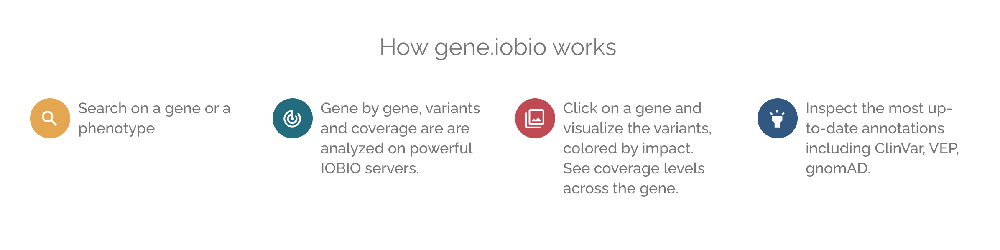
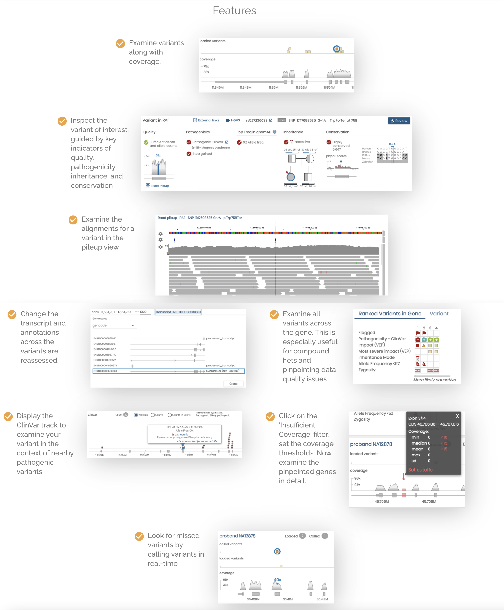

# Purpose 
[gene.iobio](https://gene.iobio) is a real-time, intuitive and interactive variant interrogation and prioritization web application. gene.iobio enables secure, clinically-driven variant prioritization, bringing clinical care providers’ intimate knowledge of the patient’s disease and phenotype closer to their genetics.  gene.iobio is publicly available at [gene.iobio.io](https://gene.iobio) - where users can try it out with demo data (NA12878 trio) or input their own data (via publicly accessible URLS or local files) using the file input dialog.

### [Watch the demo!](https://www.youtube.com/watch?v=K7JLbCv2LcA)
[](https://www.youtube.com/watch?v=K7JLbCv2LcA)

# Usage
gene.iobio is free for academic use only. For all other uses, including commercial use, please contact iobioproject@gmail.com. 

 

 

### Disclaimer
The University of Utah makes no claims that iobio applications, including gene.iobio are approved for clinical use. All users of iobio applications including gene.iobio understand and accept that any information gained by using these applications, whether the information comes from visualization, processing, internal or external databases, or analysis, may not in any way be used for clinical purposes. The University of Utah makes no representation that iobio or gene.iobio is either safe or effective for any intended use for which research may currently be performed. iobio, or any iobio applications ARE TO BE USED FOR RESEARCH PURPOSES ONLY. USE FOR CLINICAL PURPOSES IS EXPRESSLY FORBIDDEN. Approval of iobio applications for clinical use has neither been applied for, nor received, in any country, including the United States of America.

# Install
Looking to collaborate or deploy gene.iobio at your academic institute? Contact us at iobioproject@gmail.com

## Install the client application

Dependencies:
- [nodejs version 13.x](https://nodejs.org/en/download/releases/) 
- [npm](https://docs.npmjs.com/downloading-and-installing-node-js-and-npm/)

Clone the repo:
```
git clone https://github.com/iobio/gene.iobio
```

Copy sample env file
```
cd gene.iobio
cp .env.template .env
```

Start the app
```
npm install
npm run build
npm start
```

Launch on your localhost
@ [http://localhost:4026](http://localhost:4026).

## Updating
Client-side updates can be retrieved using `npm run webpack`.

## Install the server application
For help with local installs that include the server and backend computational tools, please contact iobioproject@gmail.com