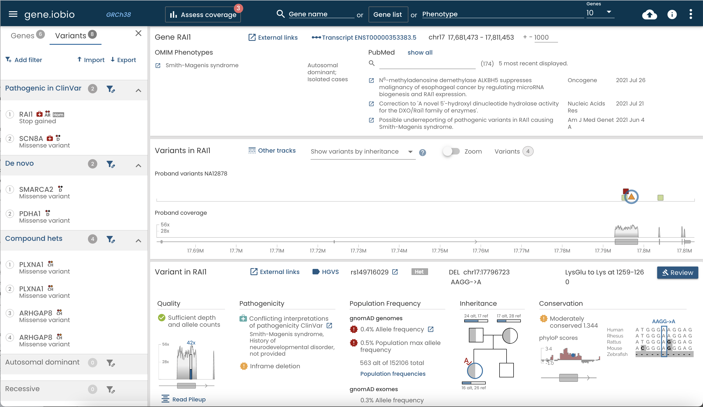

# Overview

[gene.iobio](https://gene.iobio) is an interactive application for inspecting variants in real-time.  This application is free for academic use. For all commercial use, please contact admin@frameshift.io


# Disclaimer

The University of Utah makes no claims that iobio applications, including gene.iobio are approved for clinical use. All users of iobio applications including gene.iobio understand and accept that any information gained by using these applications, whether the information comes from visualization, processing, internal or external databases, or analysis, may not in any way be used for clinical purposes. The University of Utah makes no representation that iobio or gene.iobio is either safe or effective for any intended use for which research may currently be performed.

iobio, or any iobio applications ARE TO BE USED FOR RESEARCH PURPOSES ONLY. USE FOR CLINICAL PURPOSES IS EXPRESSLY FORBIDDEN. Approval of iobio applications for clinical use has neither been applied for, nor received, in any country, including the United States of America.


 

 

 

# Installation 

## Install the client application

### Install [nodejs](https://nodejs.org/en/download/)

### Create an env file 

[Sample env file](./.env.template)
```bash
cp ./env.template .env
```

### Start the app

```
npm install
npm start
```

### Launch the app in the web browser
Now open [http://localhost:3000](http://localhost:3000).


### Rebuild after client-side changes 
To watch for client-side file changes, open up a new terminal window and `npm run webpack`.

## Install the server application

